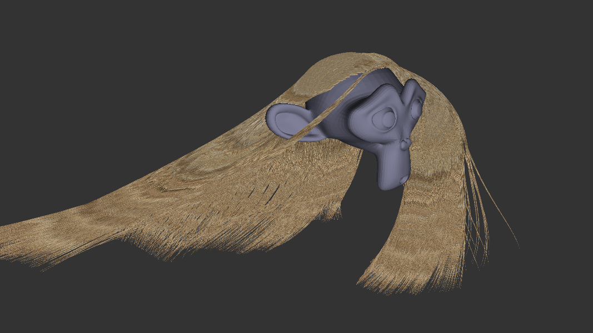

# Features
* GPU-based hair strand physics using [Verlet integration](https://www.cs.cmu.edu/afs/cs/academic/class/15462-s13/www/lec_slides/Jakobsen.pdf)
* Collision against predefined sphere colliders
* Each "strand" is represented by a ribbon of quads oriented to the view using a cylinder constraint. This means that each ribbon can represent a clump of hair strands.
* Hair strand root placements use a separate mesh for potential spawn points
* [State interpolation](https://gafferongames.com/post/fix_your_timestep/), allowing the simulation to update at an independent frequency from the frame rate
* Interactive in a web browser

# Controls
* Hold left mouse button and move the mouse to rotate the camera
* Use the scroll wheel to zoom
* Different parameters can be controlled in realtime from the UI

# The project
The project was created in Typescript and WGSL, using WebGPU, WebPack, Node.js, Visual Studio Code together with Live Server and WGSL syntax highlight extensions.
Compile and bundle with the command "npm run prod", and run the live-server to view the application.

# Potential improvements
As the project is very barebones and simple, there are a lot of improvements that could be made. Some examples are:
* Realtime shading using the Marschner model
* Strand-to-strand interactions
* Mipmaps
* Proper anti-aliasing
* More elaborate user controls
* Predefined hair styles

# Helpful resources
WebGPU: 
* https://www.youtube.com/channel/UCg14XfqXim0vpgabU3T7tRg/videos
* https://austin-eng.com/webgpu-samples/
* https://www.w3.org/TR/webgpu/

Hair simulation/rendering:
* https://www.cs.cmu.edu/afs/cs/academic/class/15462-s13/www/lec_slides/Jakobsen.pdf
* https://gafferongames.com/post/fix_your_timestep/
* https://developer.nvidia.com/gpugems/gpugems2/part-iii-high-quality-rendering/chapter-23-hair-animation-and-rendering-nalu-demo
* https://www.realtimerendering.com/
